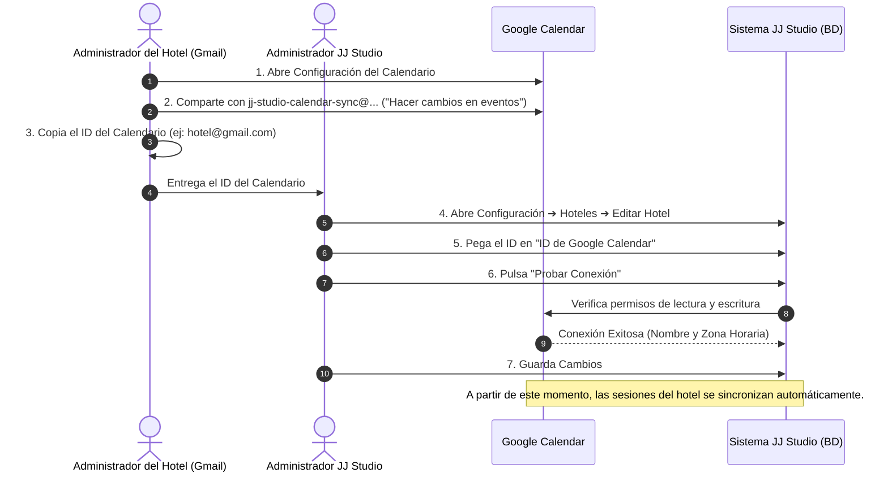

# Guía Paso a Paso: Conexión de Google Calendar por Hotel en JJ Studio

Esta guía detalla el proceso completo para configurar la sincronización de sesiones fotográficas y citas de venta con la cuenta de Google Calendar específica de cada hotel.

---

## 📌 ¿Cómo Funciona la Integración?

Cada hotel tiene su propia cuenta de Gmail o Google Workspace con su respectivo calendario. Para que **JJ Studio** pueda crear, actualizar y eliminar eventos automáticamente en dicho calendario sin pedir contraseñas personales:

1. **JJ Studio** utiliza una **Cuenta de Servicio de Google (Service Account)** centralizada:
   `jj-studio-calendar-sync@jj-studio-calendar.iam.gserviceaccount.com`
2. El hotel **comparte su calendario de Google** con este correo otorgando permisos para *«Hacer cambios en eventos»*.
3. En el panel de **JJ Studio**, se introduce el **ID del Calendario** del hotel y se verifica la conexión.



---

## 🛠️ Paso 1: Configurar el Calendario en la Cuenta de Google del Hotel

> Este paso lo realiza la persona que administra la cuenta de Gmail / Google Workspace del hotel.

1. Inicia sesión en **Google Calendar** ([calendar.google.com](https://calendar.google.com)) con la cuenta del hotel.
2. En la columna izquierda, en la sección **"Mis calendarios"**, sitúa el cursor sobre el calendario del hotel, haz clic en los **tres puntos verticales (⋮)** y selecciona **"Configurar y compartir"** (*Settings and sharing*).
3. Desplázate hacia abajo hasta la sección **"Compartir con determinadas personas o grupos"** (*Share with specific people or groups*).
4. Haz clic en **"+ Añadir personas y grupos"** (*+ Add people and groups*).
5. En el campo de correo, introduce la cuenta de servicio de JJ Studio:
   ```text
   jj-studio-calendar-sync@jj-studio-calendar.iam.gserviceaccount.com
   ```
6. En el selector de **Permisos**, selecciona:
   👉 **«Hacer cambios en eventos»** (*Make changes to events*).
   *(⚠️ Si seleccionas solo "Ver todos los detalles", el sistema no podrá crear las sesiones).*
7. Haz clic en **"Enviar"**.

---

## 📋 Paso 2: Obtener el ID del Calendario

En la misma pantalla de configuración del calendario de Google:

1. Desplázate hacia abajo hasta la sección **"Integrar el calendario"** (*Integrate calendar*).
2. Localiza el campo **"ID del calendario"** (*Calendar ID*):
   - Si es el calendario principal de una cuenta de Gmail estándar, el ID es el mismo correo electrónico (ejemplo: `hotelriu.cancun@gmail.com`).
   - Si es un calendario secundario o creado específicamente, tendrá un formato como:
     `c_abcdef1234567890@group.calendar.google.com`.
3. **Copia este ID.**

---

## ⚙️ Paso 3: Registrar el ID en JJ Studio

1. Inicia sesión en **JJ Studio** con una cuenta de **Administrador** (`ADMIN` o `SUPERUSUARIO`).
2. Ve al menú **Configuración** ➔ pestaña **Hoteles**.
3. Busca el hotel correspondiente y haz clic en el icono de **Editar (✏️)**.
4. En el formulario del hotel, desplázate hasta la sección **«Integración con Google Calendar»**.
5. En el campo **"ID de Google Calendar"**, pega el ID que copiaste en el Paso 2.
6. Haz clic en el botón **«Probar Conexión»**:
   - ✅ Si todo está correcto, aparecerá un mensaje verde de éxito mostrando el nombre oficial del calendario y su zona horaria.
   - ❌ Si muestra un error de permisos (404 o 403), revisa que el correo de servicio haya sido añadido en el Paso 1 con permisos de *«Hacer cambios en eventos»*.
7. Haz clic en **«Guardar Cambios»** al final del formulario.

---

## 🔒 Seguridad y Cifrado de Credenciales

- Las credenciales privadas de la Service Account y la comunicación con las APIs de Google se realizan bajo protocolo seguro TLS/HTTPS.
- Si un hotel requiere utilizar una **Cuenta de Servicio propia e independiente** (en lugar de la compartida por defecto), se puede cargar su archivo `service-account.json` directamente en el formulario.
- En la base de datos de JJ Studio, todas las claves privadas de cuentas de servicio se almacenan cifradas con el estándar de grado militar **AES-256-GCM** mediante la clave maestra `ENCRYPTION_KEY`.

---

## ❓ Preguntas Frecuentes y Solución de Problemas

### 1. ¿Qué ocurre si un hotel no tiene configurado Google Calendar?
El sistema funcionará con total normalidad para los fotógrafos, supervisores y vendedores en JJ Studio. Las sesiones y citas se crearán y gestionarán en la aplicación sin intentar conectar con Google (sin errores ni demoras).

### 2. ¿Qué eventos se sincronizan en Google Calendar?
- **Sesiones Fotográficas**: Título `[Hotel] [Cliente] | [Fotógrafo]`, fecha, hora de inicio (1 hora de duración), número de habitación, checkout, pax, teléfono, email, creador y notas. Se colorean en Google Calendar según el color asignado al fotógrafo.
- **Citas de Venta**: Título `[Hotel] CITA VENTA [Cliente] | [Vendedor]`, fecha, hora, detalles del cliente y vendedor asignado.

### 3. Si se elimina o cancela una sesión en JJ Studio, ¿se elimina de Google Calendar?
Sí. Cuando se elimina una sesión o cita en JJ Studio, el sistema elimina automáticamente el evento correspondiente del calendario de Google del hotel.
